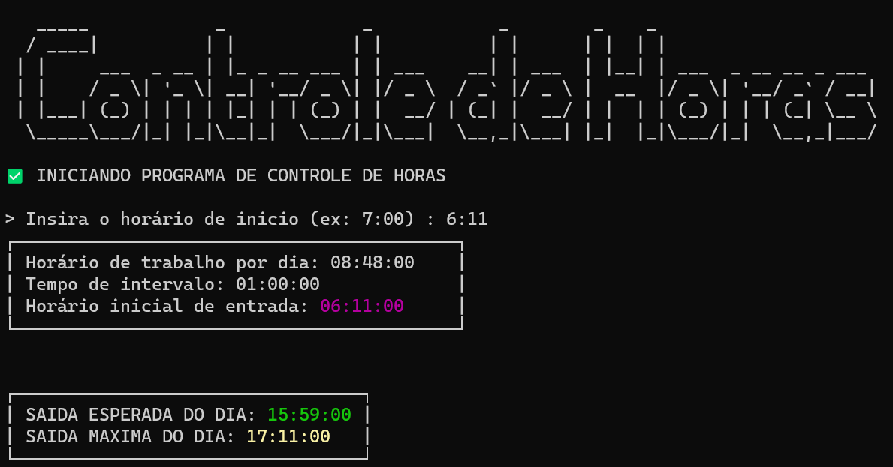
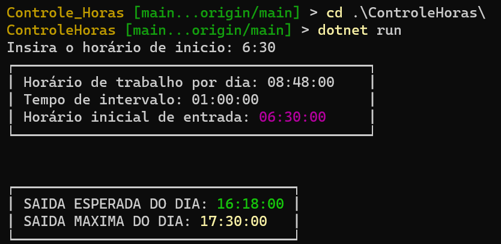
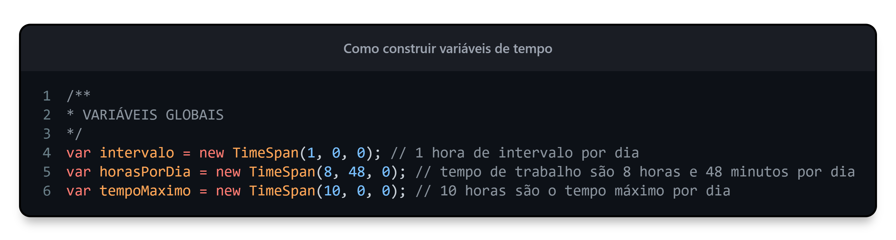
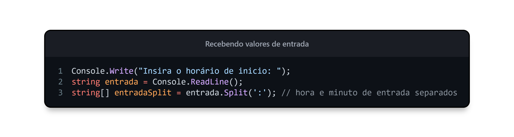
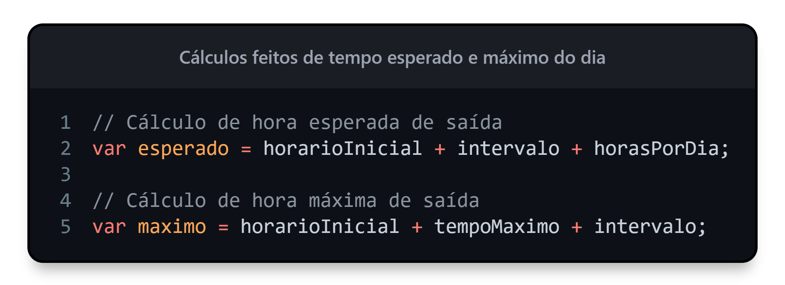
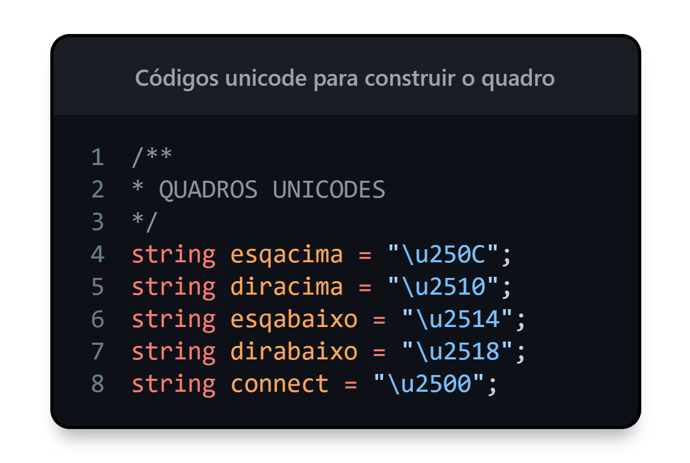
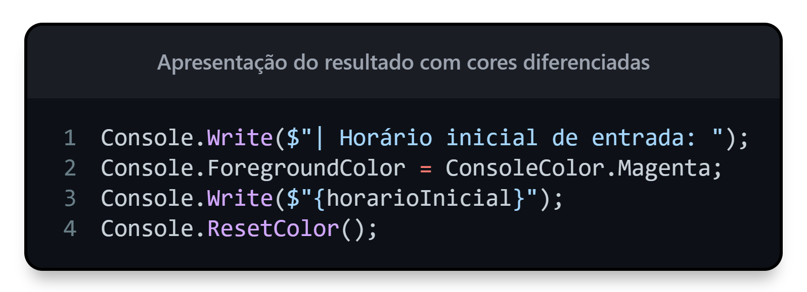

<p align="center">
    
</p>


---

### $$\boxed{\sf Definição \space do \space projeto}$$

Programa de controle de horas trabalhadas, onde recebe o horário inicial de trabalho e apresenta o valor esperado de saída (completando 8 horas e 48 minutos por dia) e o valor máximo de trabalho para não ultrapassar 10 horas de trabalho por dia.

---

### $$\boxed{\sf Saída \space Esperada}$$

Temos como entrada um horário em `horas:minutos` onde é feito os seguintes cálculos:

- Pegamos o tempo de intervalo por dia, sendo 1 hora de intervalo.
- Pegamos o tempo esperado de trabalho do dia, sendo 8 horas e 48 minutos.
- Somamos os valores para identificarmos o horário de saída esperado do dia

Exemplo: entrada as 7:51 (7 horas e 51 minutos da manhã)
$$(7:51+1:00)+8:48 = \color{lightblue}8\color{white}:\color{lightgreen}51 + \color{lightblue}8\color{white}:\color{lightgreen}48$$

Como 51 mais 48 são 99 minutos, deve ser subtraído 60 minutos porque 60 minutos são uma hora, restando somente o valor em minutos.

$$\color{lightgreen}51 \color{white}+ \color{lightgreen}48 = \color{lightgreen}99 \newline \color{white}99 - 60 = 39 \space minutos$$

Como pegamos 60 minutos, sendo uma hora, devemos somar mais um ao valor das horas.

$$\color{lightblue}8 \color{white}+ \color{lightblue}8 \color{white}+ \color{orange}1 \space \color{white} = 17 \space horas$$

O resultado:

$$8:51 + 8:48 = 17:39$$


---

### $$\boxed{\sf Saída \space Máxima}$$

Temos como entrada um horário em `horas:minutos` onde é feito os seguintes cálculos:

- Pegamos o tempo de intervalo por dia, sendo 1 hora de trabalho.
- pegamos o tempo máximo por dia, sendo de 10 horas no dia.
- somamos os valores para identificarmos o horário de saída máximo do dia.

Exemplo: entrada de 7:51 (7 horas e 51 minutos da manhã)

$$(7:51 + 1:00) + 10:00 = 8:51 + 10:00$$

A soma dos valores é mais simples, ficando o seguinte resultado:

$$8:51 + 10:00 = 18:51$$

Portando o tempo máximo de trabalho é até as `18:51`

---

### $$\boxed{\sf Como \space Compilar}$$

Coloque o arquivo `ControleHorasStart.bat` na sua área de trabalho, altere o caminho para este repositório no seu computador e clique nela para começar.

Este arquivo chama o script do powershell `ControleHoras.ps1` com os comandos necessários para iniciar o projeto.

Para rodar scripts do powershell no windows deve ser liberado da seguinte forma:

1. Acesse o powershell como administrador (Ctrl + X na área de trabalho)
2. Rode o seguinte comando no console:

``` powershell
Set-ExecutionPolicy RemoteSigned
```

Quando roda o script é apresentado no console todas as seguintes informações:

<p align="center">
    
</p>

Caso queira iniciar ele naturalmente, acesse o diretório `ControleHoras/` deste repositório e rode o seguinte comando:

$$\boxed{\color{orange}\sf dotnet \space \color{magenta} run}$$

<p align="center">
    
</p>

---

### $$\boxed{\sf Programa}$$

- Foram definidos os valores globais padrões do sistema, sendo eles o tempo de intervalo de uma hora, o tempo de trabalho padrão de cada dia e o tempo máximo de trabalho.

<p align="center">
    
</p>

- Criamos um sistema de recebimento de um valor de tempo e é feito a transformação desse valor de entrada para timestamp.

<p align="center">
    
</p>

- Temos o cálculo de horas como foi explicado na parte do cálculo, mas como o tipo de dado é o Timestamp ele já faz esse cálculo automático.

<p align="center">
    
</p>

- Para ficar bonito, criei um quadro unicode com o código para criar quadros com os valores e com informação com cores.

<p align="center">
    
</p>
- para colocar cores, foi usado os métodos do Console para colocar cores.

<p align="center">
    
</p>